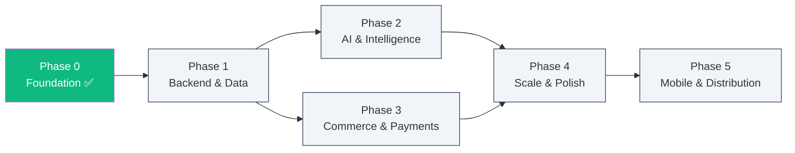

# 🚀 Development Phases

> **Phased execution plan for genericMed.**
> Each phase builds on the previous one. AI assistants should reference this file to understand scope boundaries and sequencing.
> Update status markers as work progresses.

---

## Phase Summary

| Phase | Name | Status | Target | Key Outcome |
| ----- | ---- | ------ | ------ | ----------- |
| 0 | Foundation & Prototype | ✅ Complete | — | Frontend MVP with mock data, 3 portals, auth UI |
| 1 | Backend & Data Layer | 🟢 In Progress | TBD | Express API, PostgreSQL, JWT auth, real data persistence |
| 2 | AI & Intelligence | 🔲 Not Started | TBD | Gemini AI features, smart anomaly detection, drug interaction warnings |
| 3 | Commerce & Payments | 🔲 Not Started | TBD | Payment gateway, prescription upload, real-time order tracking |
| 4 | Scale, Polish & Compliance | 🔲 Not Started | TBD | WebSockets, search, analytics, i18n, HIPAA audit |
| 5 | Mobile & Distribution | 🔲 Not Started | TBD | PWA / React Native, app store deployment |

---

## Phase 0 — Foundation & Prototype ✅

> **Status**: Complete
> **Commits**: `8b9893d` → `6325590` → `353f7d8`

### Objective

Build a fully interactive frontend prototype that demonstrates the platform's three portals, governance workflows, and marketplace experience — all using mock data.

### Deliverables

- [x] Vite + React 19 + TypeScript 5.8 project scaffold
- [x] Tailwind CSS v4 with custom design tokens (Plus Jakarta Sans, JetBrains Mono)
- [x] Multi-portal architecture (`admin` | `customer` | `store`)
- [x] Admin Portal — Governance Dashboard, Price Radar, Partner Verification, Orders, Audit Logs, Tenant Management, Settings
- [x] Customer Portal — Marketplace with price comparison, cart, and checkout
- [x] Store Portal — Dashboard with inventory and fulfillment metrics
- [x] Modal system — BioStudy, Store Docs, RLS Inspector, Command Palette, Pharmacopoeia, Integrity Scan, Cart
- [x] Global Header with portal switcher and user profile
- [x] Command Palette (Ctrl+K) with global search
- [x] Toast notification system
- [x] Client-side authentication with login/register and role-based routing
- [x] Compliance export (JSON download)
- [x] SEO meta tags, Open Graph, Twitter Card
- [x] Complete TypeScript type system (`src/types/index.ts`)
- [x] Comprehensive mock data (`src/data/mockData.ts`)

### What Was Deferred

- Backend API, database, real auth, AI features, payments — all deferred to subsequent phases.

---

## Phase 1 — Backend & Data Layer 🟢

> **Status**: In Progress — Milestone 1.1 complete
> **Depends On**: Phase 0 ✅
> **Estimated Effort**: 3–4 weeks

### Objective

Replace the mock data layer with a real backend: Express API, PostgreSQL database with Row-Level Security, and JWT-based authentication.

### Milestone 1.1 — Express API Server ✅

- [x] Set up Express with TypeScript (`src/server/`)
- [x] Configure esbuild for server-side bundling
- [x] Implement health check endpoint (`GET /api/v1/health`)
- [x] Add CORS, helmet, rate limiting middleware
- [x] Add request validation (Zod)
- [x] Add structured logging (Pino)

**Acceptance Criteria**: ✅ Server starts on `npm run server`, responds to health check, and logs requests.

### Milestone 1.2 — PostgreSQL Database

- [ ] Set up PostgreSQL (local Docker or cloud instance)
- [ ] Design and create schema (6 tables: `users`, `bioequivalence_pairs`, `price_anomalies`, `stores`, `orders`, `audit_logs`)
- [ ] Implement Row-Level Security (RLS) policies for multi-tenant isolation
- [ ] Create seed script to populate database with existing mock data
- [ ] Set up database migration tooling (Knex, Prisma, or Drizzle)
- [ ] Add connection pooling (pg-pool)

**Acceptance Criteria**: `npm run db:seed` populates all tables; RLS prevents cross-tenant data access.

**Decision Required**: ORM choice — Prisma (type-safe, migrations) vs Drizzle (lightweight, SQL-first) vs raw pg (maximum control). Document in `decisions.md`.

### Milestone 1.3 — JWT Authentication

- [ ] Implement `POST /api/v1/auth/register` — hash passwords (bcrypt), create user, return JWT
- [ ] Implement `POST /api/v1/auth/login` — validate credentials, return JWT with role + tenantId
- [ ] Implement `POST /api/v1/auth/refresh` — refresh token rotation
- [ ] Add JWT middleware to protect admin/store routes
- [ ] Update frontend `AuthScreen` to call real API instead of mock validation
- [ ] Store JWT in httpOnly cookie (not localStorage) for security
- [ ] Add password reset flow (email-based)

**Acceptance Criteria**: Registration creates a user in DB; login returns valid JWT; protected routes reject unauthenticated requests.

### Milestone 1.4 — Core CRUD API Endpoints

- [ ] `GET /api/v1/medicines` — paginated medicine listing with pharmacy prices
- [ ] `GET /api/v1/medicines/:id` — medicine detail with all listings
- [ ] `GET /api/v1/bioequivalence` — list pairs (admin only)
- [ ] `PATCH /api/v1/bioequivalence/:id/approve` — approve signoff (admin only)
- [ ] `GET /api/v1/anomalies` — list anomalies (admin only)
- [ ] `PATCH /api/v1/anomalies/:id/quarantine` — toggle quarantine (admin only)
- [ ] `PATCH /api/v1/anomalies/:id/enforce-cap` — enforce price cap (admin only)
- [ ] `GET /api/v1/stores` — list stores (admin only)
- [ ] `PATCH /api/v1/stores/:id/authorize` — authorize store (admin only)
- [ ] `GET /api/v1/orders` — list orders (admin: all, store: own tenant)
- [ ] `POST /api/v1/orders` — create order (customer)
- [ ] `GET /api/v1/audit-logs` — list audit logs (admin only)

**Acceptance Criteria**: All frontend features work identically to Phase 0, but with persistent data.

### Milestone 1.5 — Frontend API Integration

- [ ] Create `src/services/api.ts` — centralized API client with JWT injection
- [ ] Replace all `useState(initialMockData)` with `useEffect` + API fetch
- [ ] Add loading skeletons for all data-fetching views
- [ ] Add error boundaries and retry logic
- [ ] Remove or gate `src/data/mockData.ts` behind a `USE_MOCK_DATA` flag

**Acceptance Criteria**: App boots with empty state, fetches real data, and handles network errors gracefully.

---

## Phase 2 — AI & Intelligence 🔲

> **Status**: Not Started
> **Depends On**: Phase 1 (API server running)
> **Estimated Effort**: 2–3 weeks

### Objective

Integrate Google Gemini AI for pharmacopoeia search, integrity scanning, drug interaction warnings, and intelligent anomaly detection.

### Milestone 2.1 — Gemini AI Server Integration

- [ ] Create `POST /api/v1/ai/pharmacopoeia` — query Gemini for drug information, interactions, and equivalents
- [ ] Create `POST /api/v1/ai/integrity-scan` — AI-powered platform data integrity analysis
- [ ] Add input sanitisation and prompt injection defences
- [ ] Add response caching (Redis or in-memory TTL cache)
- [ ] Add usage tracking and cost monitoring

**Acceptance Criteria**: Pharmacopoeia Modal and Integrity Scan Modal show real AI-generated results.

### Milestone 2.2 — Drug Interaction Warnings

- [ ] Add drug interaction check on cart add (`POST /api/v1/ai/interactions`)
- [ ] Display warnings in Cart Modal when interactions detected
- [ ] Allow user to acknowledge and proceed or remove conflicting item
- [ ] Log interaction warnings in audit trail

**Acceptance Criteria**: Adding Metformin + a conflicting drug shows a visible warning before checkout.

### Milestone 2.3 — Intelligent Anomaly Detection

- [ ] Replace static ±35% threshold with ML-based anomaly scoring
- [ ] Implement time-series analysis for price trend detection
- [ ] Add anomaly severity classification (low / medium / high / critical)
- [ ] Auto-quarantine critical anomalies with AI-generated justification

**Acceptance Criteria**: Price Radar shows AI confidence scores alongside variance percentages.

### Milestone 2.4 — AI-Assisted Search

- [ ] Semantic search for medicines (natural language queries)
- [ ] "Find me a cheaper alternative to [brand name]" flow
- [ ] AI-generated medicine comparison summaries

**Acceptance Criteria**: Customer can type "blood pressure medicine under $20" and get relevant results.

---

## Phase 3 — Commerce & Payments 🔲

> **Status**: Not Started
> **Depends On**: Phase 1 (orders API, user auth)
> **Estimated Effort**: 3–4 weeks

### Objective

Enable real commerce: payment processing, prescription handling, store inventory management, and live order tracking.

### Milestone 3.1 — Payment Gateway

- [ ] Integrate Stripe or Razorpay for payment processing
- [ ] Implement checkout flow: cart → address → payment → confirmation
- [ ] Add payment status tracking (pending, captured, failed, refunded)
- [ ] Store payment records linked to orders
- [ ] Handle partial refunds and cancellations

**Decision Required**: Payment provider — Stripe (global, USD-first) vs Razorpay (India-first, INR). Document in `decisions.md`.

**Acceptance Criteria**: Customer can pay with card/UPI; store owner sees payment confirmed in fulfillment view.

### Milestone 3.2 — Prescription Upload & Verification

- [ ] Add prescription image upload (drag-and-drop + camera capture)
- [ ] OCR processing (Google Cloud Vision or Gemini multimodal)
- [ ] Extract medicine name, dosage, doctor details from prescription
- [ ] Auto-match prescription items to marketplace medicines
- [ ] Pharmacist verification queue in Store Portal
- [ ] Store prescription images securely (encrypted at rest, HIPAA-compliant)

**Acceptance Criteria**: Patient uploads prescription photo → system extracts medicines → adds to cart for review.

### Milestone 3.3 — Store Inventory Management

- [ ] Full CRUD for pharmacy inventory (`/api/v1/stores/:id/inventory`)
- [ ] Bulk import via CSV/Excel upload
- [ ] Stock level alerts (low stock, out of stock)
- [ ] Price update workflows with anomaly guardrails
- [ ] Inventory sync API for POS system integration

**Acceptance Criteria**: Store owner can add/edit/remove inventory items; price changes trigger anomaly checks.

### Milestone 3.4 — Real-Time Order Tracking

- [ ] Order status progression: `PLACED` → `VERIFIED` → `DISPATCHED` → `IN_TRANSIT` → `DELIVERED`
- [ ] Map integration (Google Maps or Mapbox) for delivery tracking
- [ ] Estimated time of arrival (ETA) updates
- [ ] Delivery partner assignment and tracking
- [ ] Customer notification at each status change

**Acceptance Criteria**: Customer sees live map with delivery driver location after dispatch.

---

## Phase 4 — Scale, Polish & Compliance 🔲

> **Status**: Not Started
> **Depends On**: Phases 1–3 substantially complete
> **Estimated Effort**: 4–6 weeks

### Objective

Harden the platform for production: real-time features, advanced search, analytics, internationalisation, and regulatory compliance.

### Milestone 4.1 — Real-Time Notifications (WebSockets)

- [ ] Set up Socket.IO or native WebSocket server
- [ ] Live order status updates (push to customer + store)
- [ ] Live anomaly alerts for admin dashboard
- [ ] Live audit log streaming
- [ ] Notification bell with unread count in Header

**Acceptance Criteria**: Admin sees new anomalies appear without page refresh; customer sees order status change live.

### Milestone 4.2 — Advanced Search

- [ ] Integrate Elasticsearch or Algolia
- [ ] Faceted search: category, price range, dosage, availability, rating
- [ ] Autocomplete with typo tolerance
- [ ] Search analytics (popular queries, zero-result queries)

**Acceptance Criteria**: Search returns results in <200ms with filters and autocomplete.

### Milestone 4.3 — Analytics Dashboard

- [ ] Admin analytics page with interactive charts (Recharts or Chart.js)
- [ ] Metrics: revenue, orders, user growth, savings delivered, anomalies resolved
- [ ] Time-range selector (7d, 30d, 90d, 1y)
- [ ] Export reports as PDF/CSV
- [ ] Store-level analytics for pharmacy owners

**Acceptance Criteria**: Admin sees revenue trend chart, top medicines by savings, and anomaly resolution rate.

### Milestone 4.4 — Multi-Language Support (i18n)

- [ ] Set up `react-i18next` or `next-intl`
- [ ] Extract all UI strings to translation files
- [ ] Support: English (default), Hindi, Tamil, Telugu, Bengali
- [ ] Language switcher in Header
- [ ] RTL support if Urdu/Arabic added later

**Acceptance Criteria**: Switching language updates all UI text without page reload.

### Milestone 4.5 — HIPAA Compliance & Security Audit

- [ ] Encrypt all PII at rest (AES-256)
- [ ] Encrypt all API traffic (TLS 1.3)
- [ ] Implement data retention policies (6-year minimum per HIPAA § 164.316)
- [ ] Audit log immutability verification (SHA-256 chain validation)
- [ ] Penetration testing and vulnerability assessment
- [ ] Business Associate Agreements (BAA) with cloud providers
- [ ] Document compliance posture for regulatory review

**Acceptance Criteria**: Pass third-party HIPAA compliance audit; all PII encrypted; audit trail tamper-proof.

### Milestone 4.6 — Performance & Infrastructure

- [ ] CDN for static assets (Cloudflare or Cloud CDN)
- [ ] Database read replicas for high-traffic queries
- [ ] Redis caching layer (sessions, API responses, rate limiting)
- [ ] Horizontal scaling with container orchestration (Cloud Run or Kubernetes)
- [ ] Monitoring and alerting (Prometheus + Grafana or Cloud Monitoring)
- [ ] 99.9% uptime SLA target

**Acceptance Criteria**: Lighthouse score ≥90; API p95 latency <200ms; zero downtime deployments.

---

## Phase 5 — Mobile & Distribution 🔲

> **Status**: Not Started
> **Depends On**: Phases 1–4 substantially complete
> **Estimated Effort**: 4–6 weeks

### Objective

Expand to mobile platforms and prepare for public launch.

### Milestone 5.1 — Progressive Web App (PWA)

- [ ] Add service worker for offline support
- [ ] App manifest for install prompt
- [ ] Push notifications (Web Push API)
- [ ] Offline cart and order history caching

**Acceptance Criteria**: App installable on mobile; basic browsing works offline.

### Milestone 5.2 — React Native App (Optional)

- [ ] Shared business logic with web app
- [ ] Native navigation and gestures
- [ ] Camera integration for prescription upload
- [ ] Push notifications (FCM / APNs)
- [ ] App Store + Play Store submission

**Decision Required**: PWA-only vs React Native vs both. Document in `decisions.md`.

**Acceptance Criteria**: Native app published to at least one app store.

### Milestone 5.3 — Launch Readiness

- [ ] Production deployment pipeline (CI/CD)
- [ ] Staging environment for QA
- [ ] Load testing (target: 10K concurrent users)
- [ ] Legal review (Terms of Service, Privacy Policy)
- [ ] Customer support system (Intercom or Zendesk)
- [ ] Marketing landing page
- [ ] Launch checklist sign-off

**Acceptance Criteria**: All systems green; stakeholder sign-off received; go-live executed.

---

## Dependencies Graph

> **Note**: Phases 2 and 3 can run in parallel after Phase 1 is complete. Phase 4 requires substantial completion of both. Phase 5 is the final stretch.

---

## Status Legend

| Marker | Meaning |
| ------ | ------- |
| ✅ | Complete |
| 🟢 | In Progress — on track |
| 🟡 | In Progress — at risk |
| 🔲 | Not Started |
| ❌ | Blocked |
| ⏸️ | Paused / Deferred |
